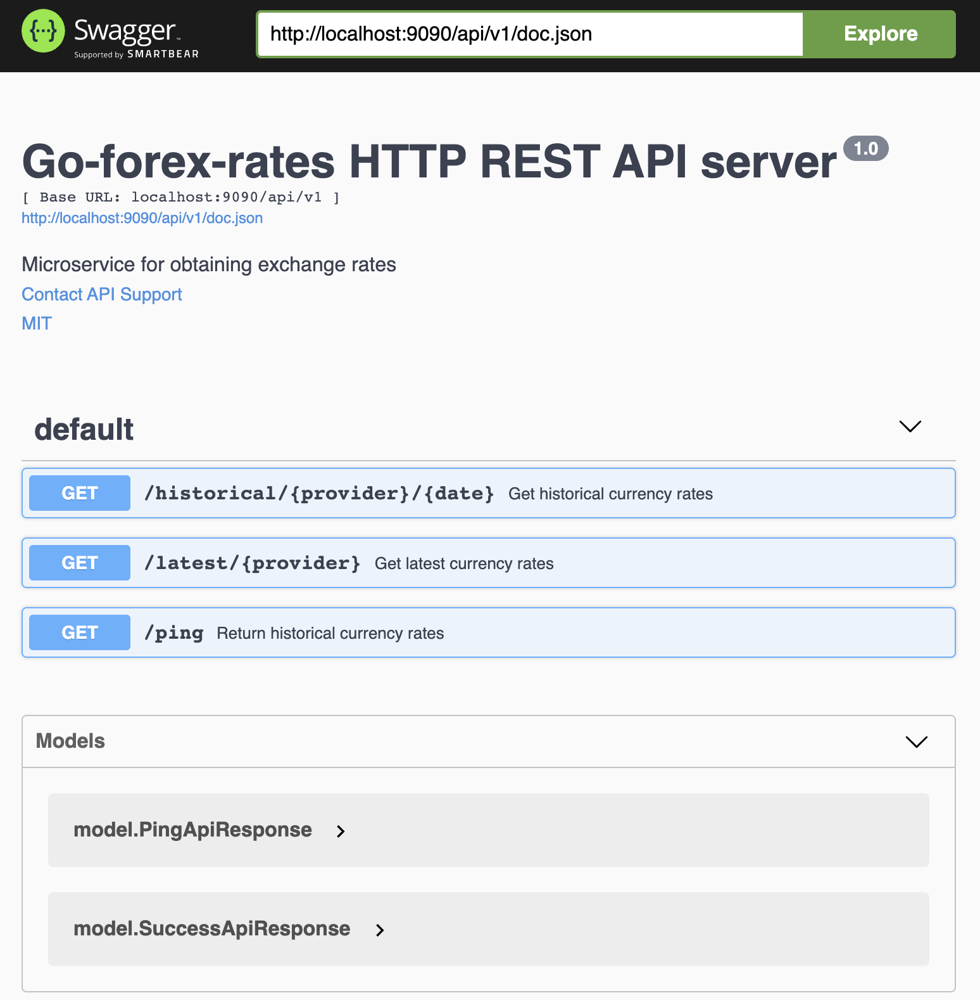

# go-forex-rates


[](https://pkg.go.dev/github.com/netandreus/go-forex-rates?tab=doc)
[](https://gitter.im/netandreus/go-forex-rates?utm_source=badge&utm_medium=badge&utm_campaign=pr-badge&utm_content=badge)

**go-forex-rates** - is an HTTP server provides REST API Gateway for multiple currency rates providers.
  
It aggregates various types of currency rates source (such as plain html page or third-party API) in a single REST API with common endpoints.
Now application supports two endpoints: ```historical``` for historical currency rates and ```latest``` for real-time currency rates.
You can write your own Provider, implemented RatesProvider interface for custom third-party API or another data source.
  
This server uses two level cache (in-memory for temporary rates and persistent for historical rates) to reduce number of API calls to third-party providers. You can tune cache settings in configuration file.
Package includes docker image and systemd-unit for drop-in integration with your current infrastructure.
## Contents

- [Currency rates microservice](#currency-rates-microservice)
    - [Contents](#contents)
    - [Features](#features)
      - [Build-in providers](#build-in-providers)
      - [Build-in cache storages](#build-in-cache-storages)
    - [Endpoints](#endpoints)
      - [Historical](#historical)
      - [Latest](#latest)
    - [Automatic rates preload](#automatic-rates-preload)
    - [Screenshots](#screenshots)
    - [Architecture](#architecture)
    - [Naming](#naming)
    - [Cache subsystem](#cache-subsystem)
    - [Configuration](#configuration)
    - [Installation](#installation)
    - [Build project](#build-project)
    - [Run](#run)
    - [Import historical data](#import-historical-data)
    - [Custom HTTP port](#custom-http-port)
      - [in application](#custom-http-port-in-application)
      - [in swagger playground](#custom-http-port-in-swagger-playground)
    - [Custom provider](#custom-provider)
      - [Constructor](#constructor)
      - [Provider config](#provider-config)
      - [Register provider](#register-provider)
      - [Database enum](#database-enum)
    - [API docs and playground](#api-docs-and-playground)
    - [Docker](#docker)
    - [Systemd service](#systemd-service)
    - [Community](#community)

## Features
* ✅ Fetch historical currency exchange rates
* ✅ Fetch latest (real-time) currency exchange rates
* ✅ Automatic preload historical exchange rates (integrated cron service)
* ✅ Dependency injection supported
* ✅ Multi-level cache for rates
* ✅ Rates providers included
  * Fixer
  * Emirates
* ✅ Your custom rates provider supporting
* ✅ Swagger UI
* ✅ Clear API Request and Response
* ✅ Docker image & service health check

### Build-in providers
* Fixer
* Emirates

### Build-in cache storages
* Memory
* MySQL

## Endpoints
There are two API endpoints.

### Historical
The historical endpoint provides historical currency rates for given base currency and quoted currencies.
These rates persist in L2 cache.

**Request example:**
  
```shell
curl -X GET "http://localhost:9090/api/v1/historical/fixer/2021-08-02?base=EUR&symbols=AED%2CUSD" -H "accept: application/json"
```

**Response example:**
```json
{
  "success":true,
  "historical":true,
  "date":"2021-08-02",
  "timestamp":1627948799,
  "base":"EUR",
  "rates":{
    "AED":4.361358,
    "USD":1.187345
  }
}
```

### Latest
The Latest endpoint provides real-time currency rates from provider (with help of force=true request parameter) or
cacheable (in L1 cache) rates with ttl defined in ```l1_cache.default_expiration``` parameter in ```config.yml``` (or ENV variable).
The Latest rates  has never cached in L2 cache.

```shell
curl -X GET "http://localhost:9090/api/v1/latest/fixer?base=AED&symbols=EUR%2CUSD" -H "accept: application/json"
```

**Response example:**
```json
{
  "success": true,
  "historical": false,
  "date": "2021-08-05",
  "timestamp": 1628151663,
  "base": "AED",
  "rates": {
    "EUR": 0.230008,
    "USD": 0.272242
  }
}
```

## Automatic rates preload
**go-forex-rates** supports historical currency rates automatic fetch with help of integrated cron subsystem.
You can enable it for selected provider(if it supports it) this way.
Edit config.yml, set these parameters:
```yaml
historical_preload: true
rates_generated_time: 23:00:00
historical_start_date: "2018-11-01"
```
- **historical_preload** - enables automatic rates preload
- **historical_start_date** - preload rates from this date
- **rates_generated_time** - after this time today historical rates exists at provider side. Service can fetch them.

After first run go-forex-rates makes initial rates preload for such providers to fill L2 persistent cache.

## Screenshots
Screenshots can be found in ```./docs/screenshots```



## Architecture
This microservice based on these parts:
- Dependency injection container: [dig](go.uber.org/dig)
- Web framework: [gin](github.com/gin-gonic/gin)
- ORM: [gorm](gorm.io/gorm)
- Scrapping framework: [colly v2](github.com/gocolly/colly)
- Cache: [go-cache](github.com/eko/gocache)

## Naming
- Package name: **go-forex-rates**
- Database name: **go_forex_rates**
- Table name: **currency_rate**
- Docker service name: **goforexrates**
- Systemd service name: **goforexrates**

## Cache subsystem
Service uses multi-level cache. There are 3 levels of abstraction:
- L1: very fast temporary in-memory cache [patrickmn/go-cache](github.com/patrickmn/go-cache)
- L2: fast persistent cache [gorm-mysql](gorm.io/driver/mysql)
- L3: slow API-request to third-party currency rates provider.

### Notes
- Chained cache pattern populate L1 & L2 cache when fetching data from L2; populate L1 cache when fetching data from L2.
- Persistent caching L2 enables only for immutable (historical) currency rates.
- L1 caching enable for all rates.

## Configuration
Sample configurations located in ./configs/config.yml.dist.
Almost all configuration properties can be overwritten by ENV variables. YAML-ENV mapping you can find in ```./internal/model.ApplicationConfig.go```

## Installation
System requirements:
```shell
> go version
go version go1.16.7
```
Install package and dependencies:
```shell
go get -u github.com/netandreus/go-forex-rates
cp ./configs/config.yml.dist ./configs/config.yml
```
Feel free to edit config.yml with your settings. Microservice needs MySQL database server for store L2 cache immutable (historical) values.

## Build project
Build program by:
```shell
go get -d ./...
go get -u github.com/swaggo/swag/cmd/swag
go build -o main
```

## Run
Run program by:
```shell
go run .
```

## Import historical data
For you patient we added historical currency rates for "emirates" provider in to this distributive.
If you are on docker host, and your MySQL container exported 3306 port to host you can do something like this.
```shell
gunzip < ./assets/go_forex_rates.sql.gz  | mysql -h 127.0.0.1 -P 3306 --ssl-mode=disabled -u go_forex_rates -p go_forex_rates
```

### Export historical data to file
You can export saved historical currency rates from database back to file.
```shell
mysqldump  -h 127.0.0.1 -P 3306 --ssl-mode=disabled --column-statistics=0 -u go_forex_rates -p go_forex_rates | gzip -v9 > ./assets/go_forex_rates.sql.gz
```

## Custom HTTP port

### Custom HTTP port in application
To changing http port:
- please edit it in ```./configs/config.yml``` in ```engine.port``` section.
- change port in docker-compose.yml in ports section and in services.goforexrates.healthcheck.test section


### Custom HTTP port in swagger playground
If you want to swagger playground works correct you should do either:
- Change port in ```main.go``` docblock comment, rebuild manual(./api/*) ```sh $HOME/go/bin/swag init --output=./api```, rebuild and restart container after it.
```
// @host localhost:9090
```
**OR**
- Manually change port in ```./api/swagger.json``` and ```./api.swagger.yaml```

## Custom provider
You can write your own provider implementing RatesProvider interface (./internal/pkg/provider/RatesProvider.go).

### Constructor
In Provider's constructor you can use any service, registered in DIC. Just add it as an argument of constructor function.

```go
package custom_provider

const Code = "custom_provider_code"

func New(db *gorm.DB, config *model.ApplicationConfig) *Provider {
  provider := &Provider{
    code:   Code,
    db:     db,
    config: config.Providers[Code],
  }
  return provider
}
```

### Provider config
Next you can add some config parameters for your provider in ./configs/config.yml in **providers** section with the key
you chosen in **Code** constant.

```yaml
providers:
  custom_provider_code:
    location: Europe/Moscow
    rates_generated_time: 23:00:00
    supported_currencies: ["AED", "ARS"]
    historical_preload: true
    historical_start_date: "2018-11-01"
```
### Register provider
Registration processed in ```init``` function like this:
```go
// init initialize server
func init() {
...
  // Add rates providers
  srv.ContainerInvoke(func(registry *provider.Registry, db *gorm.DB, config *model.ApplicationConfig) {
    ...
    registry.AddProvider(custom_provider_code.New(db, config))
    ...
  })
...
}
```

### Database enum
Change currency_rate.provider enum with new custom provider code.

## API docs and playground
Generate API docs in folder "api"

```shell
$HOME/go/bin/swag init --output=./api
```

You can test API here: ```http://localhost/swagger/index.html```

## Godoc
You can run ```Go Documentation Server``` with actual version of documentation with this command:

```shell
$HOME/go/bin/godoc -http=:8080
```

Documentation will be available by this url:
  
http://localhost:8080/pkg/github.com/netandreus/go-forex-rates/pkg/server/

## Docker
Service try to search MySQL server in attached networks. If you don't have ```common_network``` docker network - you should create it
```shell
docker network create common_network
```
or comment this network in ```docer-compose.yml``` file.

If you does not have mysql user on database host - you should create it.
Connect to MySQL as root user and run:
  
```mysql
CREATE DATABASE go_forex_rates CHARACTER SET utf8 COLLATE utf8_general_ci;
CREATE USER 'go_forex_rates'@'%' IDENTIFIED BY 'xxxxxxx';
GRANT ALL PRIVILEGES ON go_forex_rates. * TO 'go_forex_rates'@'%';
FLUSH PRIVILEGES;
```
### Single run
```shell
docker run --network=host -e "L2_HOSTNAME=host.docker.internal" go-forex-rates_goforexrates
```

### Docker-compose
Command for build container:
```shell
export HOSTNAME; sudo docker-compose build
```

Command for run container:
```shell
export HOSTNAME; docker-compose up
```
Docker-host's HOSTNAME will be used as Swagger hostname later.

## Systemd service
You can find systemd service file in ```./init/goforexrates.service```  
Default install path and working dir is: ```/home/admin/goforexrates/current```  
You can change it for your needs.

## Community

Please feel free to contribute on this library and do not hesitate to open an issue if you want to discuss a feature.
